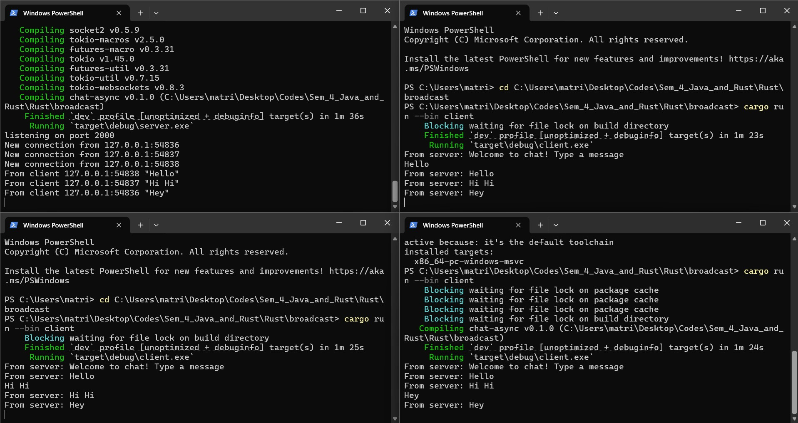

# Advanced Programming Module 10

## Asynchronous Programming - Broadcast Chat

### Reflection

##### Experiment 2.1:
Steps to run the broadcast chat:
1. Open 4 terminals in the root directory
2. Type `cargo run --bin server` to run the server in the first terminal
3. Type `cargo run --bin client` in the remaining terminals to run the client

Type a message in a client terminal. Watch the message from the client get received by the server, which is then broadcasted to all the other clients.