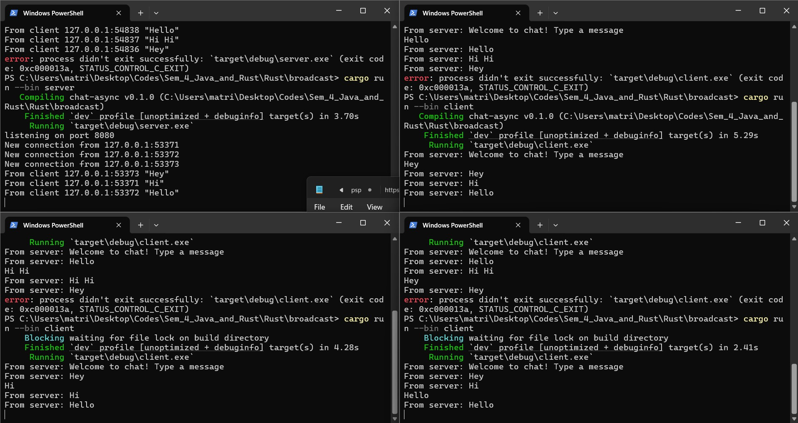

# Advanced Programming Module 10

## Asynchronous Programming - Broadcast Chat

### Reflection

#### Experiment 2.1: Running the Broadcast
Steps to run the broadcast chat:
1. Open 4 terminals in the root directory
2. Type `cargo run --bin server` to run the server in the first terminal
3. Type `cargo run --bin client` in the remaining terminals to run the client

Type a message in a client terminal. Watch the message from the client get received by the server, which is then broadcasted to all the other clients.

#### Experiment 2.2: Changing Ports

In `server.rs` I changed the port number to 8080 in the `TcpListener` function.
I also made the port number in `client.rs` match which is in the `
async fn main() -> Result<(), tokio_websockets` crate.

Compared to the client side, the websocket protocol is not declared explicitly but it is implemented in the `tokio-websockets` crate. Morevoer, port 8080 is binded to a TCPListener which assigns a process that listens for an TCP connection going through that port. The server creates a socket when a connection is established, which is then passed to the websocket handler.